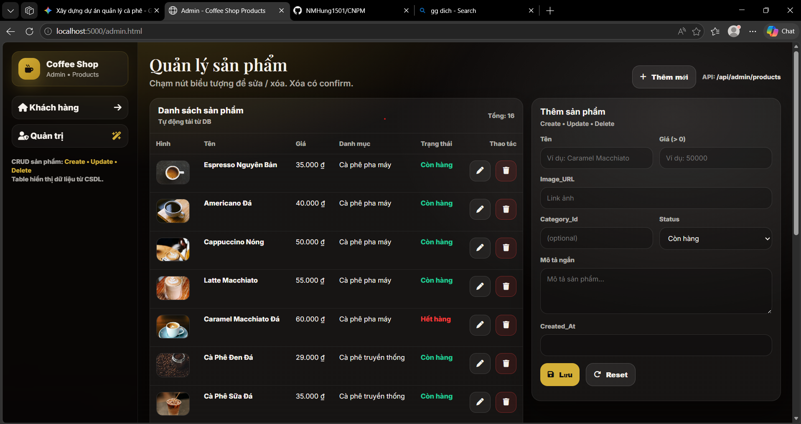

TODO - Coffee Shop Product System
 Scaffold server/client folder structure (done phần cấu trúc tối thiểu, cần tiếp tục)
 Thêm package.json đầy đủ cho server (dependencies/devDependencies)
 Tạo backend CRUD cho Categories/Products (routes + controllers + validation)
 Tạo frontend Customer page (Product Showcase) + filter/search
 Tạo frontend AdminDashboard (table + create/update/delete forms + confirm)
 Seed dữ liệu mẫu + script tạo DB
 Chạy thử: migrate/create schema.sql + test API + chạy frontend
 
 

